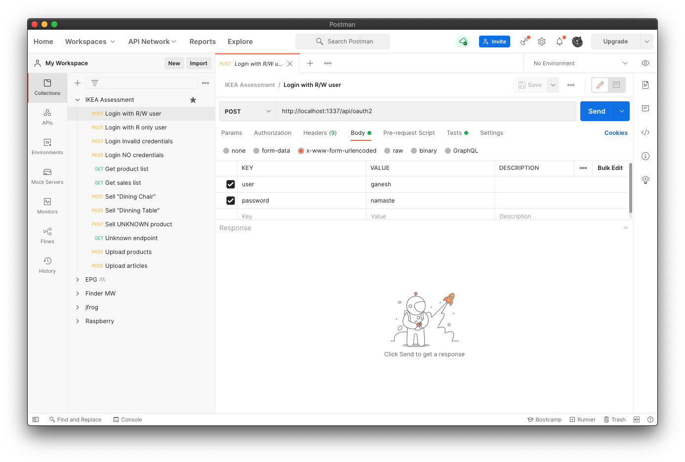
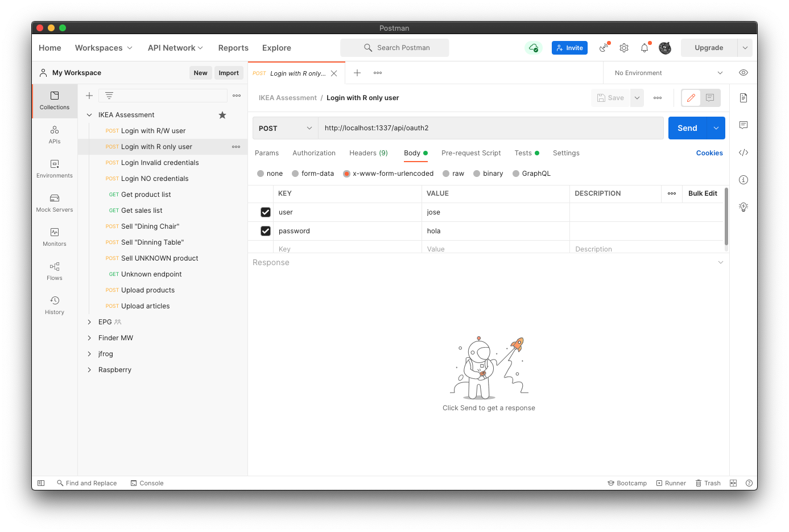
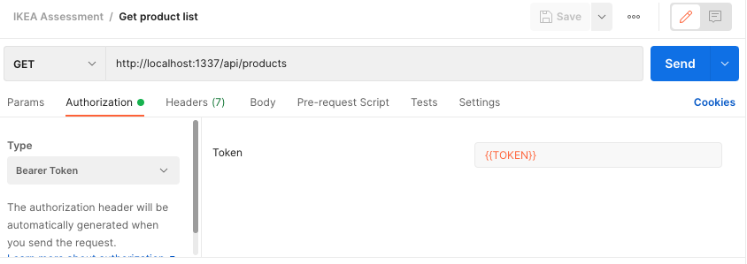
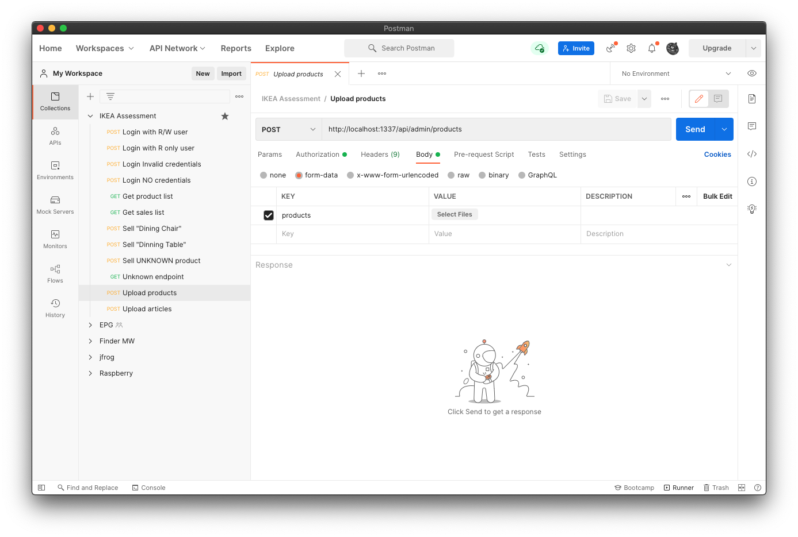

# com.ingka.assignment

## Intro

This assignment will be used as a discussion during a technical interview.
Time constraints are part of software development and even though we don't expect a perfect solution, imagine your code to be on its way to production.
If you have to make compromises, provide a README to briefly explain pros and cons of your approach, what considerations you would make for another iteration and in general what your
future colleagues might be interested in if they had to pick up your code.

The primary values for the code we look for are: simplicity, readability, maintainability, testability. It should be easy to scan the code, and rather quickly understand what it’s doing.
Pay attention to naming.

You may choose any coding language, and we look forward to discussing your choice.

## The Task

The assignment is to implement a warehouse software. This software should hold articles, and the articles should contain an identification number, a name and available stock.
It should be possible to load articles into the software from a file, see the attached inventory.json.
The warehouse software should also have products, products are made of different articles. Products should have a name, price and a list of articles of which they are made from with a quantity.
The products should also be loaded from a file, see the attached products.json.

The warehouse should have at least the following functionality;

- Get all products and quantity of each that is an available with the current inventory
- Remove(Sell) a product and update the inventory accordingly

## My solution

My proposal is a NodeJS Rest API using ExpressJS with the following endpoints:

- POST /api/oauth
- GET /api/products - available products
- GET /api/sales - sold product list
- POST /api/sales/:name - sell a product
- POST /api/admin/products - upload a products JSON file
- POST /api/admin/articles - upload an articles JSON file

In the application, there is two kind of users:

- _read and write_ role users
- _read only_ users

To upload files or to sell a product, you are going to need to be authenticated with a _read and write_ user.

Note: this project was created using node _16.6.1_. It should work with node 12+. You could use [nvm](https://github.com/nvm-sh/nvm) to manage different versions of node in your system.

## How to start

- Clone this repo
- Install the dependencies with `npm i`
- Start the server with `npm start` or use `npm run dev` to enable logs and check what is happening

Server doesn't persist data so it will reset its content each time you start it.

### Env vars

- DEBUG: Use `DEBUG=error*,warn*,info*,debug*` to trace what is doing the API
- PORT: default value is 1337

## Interacting with the API

After starting the server (with `npm start` or `npm run dev`), you can play with the endpoints by using this [Postman collection](./campana-joseluis.postman_collection.json). [Get postman here](https://www.postman.com/).

You need to get a token first so go to _Login with R/W_ or _Login with R only user_:

Click the **Send** button to get _the access_token_.

So now, you can check all the other endpoints because postman will grab the token from the login response and update a variable used in the collection:

To upload a product JSON file, just go to "Upload products", go to "Body" tab and click on "Select files" button to select a JSON file on your local drive.

Same procedure for uploading an articles (inventory) JSON file.

## Improvement areas

- Create a refresh token feature / endpoint
- Add a Redis service or another kind of database (Postgres, MongoDB, ...) to persist data and to make scalable the solution
